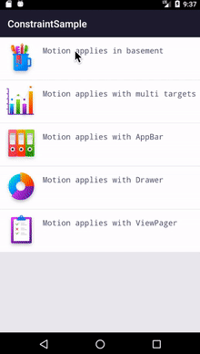

# MotionLayoutSamples
This project contains android ConstraintLayout2.0 usages and MotionLayout usage, includes code practicing about animation as well.

> 主要用来练习和扩展一些关于 ***`ConstraintLayout`***、***`MotionLayout`***  的用法，还包含 MotionLayout 的实战训练。

## 最新进展

- **ConstraintLayout 1.x** 功能实践

- 升级和适配 AndroidX

- **sample data** 用法实践

- **MotionLayout** 入门版实践

- 结合 MD 系列组件实现部分复杂交互效果

- 与 **Lottie** 实现联动

- Alpha version preview:

  

## 问题收集

- ~~官方提供的demo在通过 DrawerMotion 与 CoordinatorLayout 中已有 Motion 交互时出现 NestedScrollView 滑动问题~~
- ~~android.support 版 ConstrintLayout：2.0.0-beta2 包在运行demo代码时出现 motion 的 `progress` 无效问题，并且设置 debugMode 会闪退。问题详见：[#95](https://github.com/googlesamples/android-ConstraintLayoutExamples/issues/95)~~

## 接下来

- 介绍和使用 KeyTrigger
- Motion Editor使用介绍
- 多状态的介绍和使用
- 与RecyclerView的强强联合
- 优雅的炫酷引导页实现
- 优化和改造sample示例
- MotionLayout 高级属性和用法
- 补充相关参考文档和国外相关文章
- 更新Readme和效果图

## Learn more

> *[Using MotionLayout to Animate Android Apps](https://codelabs.developers.google.com/codelabs/motion-layout/index.html?index=..%2F..index#0)*
>
> *[MotionLayout官方介绍](https://developer.android.com/training/constraint-layout/motion-layout)*
>
> *[Introduction to MotionLayout](https://medium.com/google-developers/introduction-to-motionlayout-part-i-29208674b10d)*

## What's more?

每日一道面试题，挖掘更加强大的自己👉：[**Android Daily Interview**](https://github.com/Moosphan/Android-Daily-Interview)