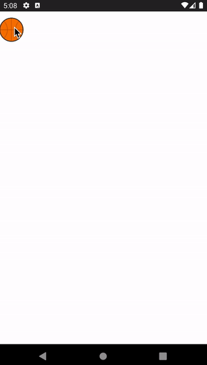
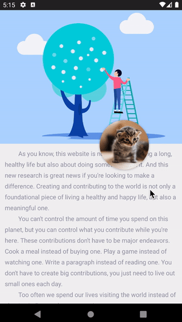
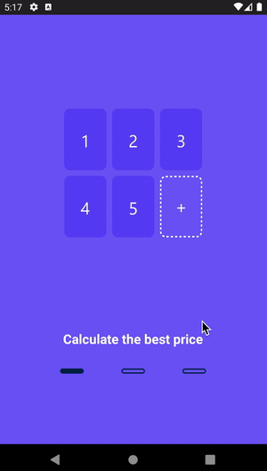

# MotionLayoutSamples
This project contains android ConstraintLayout2.0 usages and MotionLayout usage, includes code practicing about animation as well.

> 主要用来介绍一些关于 ***`ConstraintLayout`***、***`MotionLayout`***  的用法，还包含 MotionLayout 的实战训练。

## My Articles

- [MotionLayout: 打开动画新世界大门 (part I)](https://juejin.im/post/6844903918598635534)
- [MotionLayout: 打开动画新世界大门 (part II)](https://juejin.im/post/6860316642887663624)

- MotionLayout: 打开动画新世界大门 (part III)

## Effect Preview

|                   :dark_sunglasses:                    |                    :deciduous_tree:                    |                :green_salad:                 |
| :----------------------------------------------------: | :----------------------------------------------------: | :------------------------------------------: |
|  |            |  |
|        |  |                                              |

## Done

- **ConstraintLayout 1.x** 功能实践

- 升级适配至 AndroidX

- 介绍 KeyFrameSet 藏宝阁

- 结合 MD 系列组件实现部分复杂交互效果

- 与 **Lottie** 实现联动

## Next

- 介绍和使用 **KeyTrigger**
- **Motion Editor** 使用介绍
- **多状态**的介绍和使用
- 与 **RecyclerView** 的强强联合
- 优化和改造sample示例
- 更新Readme和效果图

## Question Collection

- ~~官方提供的demo在通过 DrawerMotion 与 CoordinatorLayout 中已有 Motion 交互时出现 NestedScrollView 滑动问题~~
- ~~android.support 版 ConstrintLayout：2.0.0-beta2 包在运行demo代码时出现 motion 的 `progress` 无效问题，并且设置 debugMode 会闪退。问题详见：[#95](https://github.com/googlesamples/android-ConstraintLayoutExamples/issues/95)~~

## Thanks

> *[Using MotionLayout to Animate Android Apps](https://codelabs.developers.google.com/codelabs/motion-layout/index.html?index=..%2F..index#0)*
>
> *[MotionLayout官方介绍](https://developer.android.com/training/constraint-layout/motion-layout)*
>
> *[Introduction to MotionLayout](https://medium.com/google-developers/introduction-to-motionlayout-part-i-29208674b10d)*

## What's more?

每日一道面试题，挖掘更加强大的自己👉：[**Android Daily Interview**](https://github.com/Moosphan/Android-Daily-Interview)